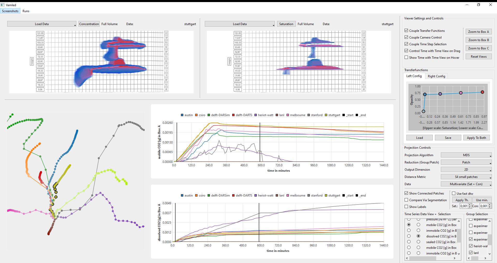

# Visual Ensemble Analysis of Fluid Flow in Porous Media across Simulation Codes and Experiment

The repository provides code and data used in the publication [Visual Ensemble Analysis of Fluid Flow in Porous Media across Simulation Codes and Experiment](https://doi.org/10.1007/s11242-023-02019-y).



# Reproduce results

[Git](https://git-scm.com/) must be installed and this repository cloned or downloaded.
All commands are expected to be run in the cloned directory `.../VisualSpatioTempEnsembleAnalysis>`.

## Set Up Python Environment
A [Python](https://www.python.org/downloads/release/python-3111/) (tested with Python 3.11.1) environment is required to run this project.
The environment requires the packages specified in the [requirements.txt](./requirements.txt) file.
Additionally, to these, the packages [rbnbr_pyutility](https://github.com/rbnbr/PythonUtility) and [rbnbr_qtpythonexamples](https://github.com/rbnbr/QTPythonExamples) are required, that can be installed as shown below.
All described calls to Python below are expected to be done using the Python Interpreter of this environment. 

The use of a virtual environment is recommended.
Once you have Python installed on your system, you can create a virtual environment with the corresponding packages as follows:
```sh
python -m venv venv  # create the virtual python environment called `venv`
source venv/bin/activate  # activate the virtual environment. use ".\venv\Scripts\activate.bat" on Windows.
pip install -r ./requirements.txt  # install the required packages in that virtual environment
```

After installing the packages from the [requirements.txt](./requirements.txt), install the additional two packages specified above in the virtual environment:
````sh
pip install git+https://github.com/rbnbr/PythonUtility.git@0.0.13  # install rbnbr_pyutility
pip install git+https://github.com/rbnbr/QTPythonExamples.git@v0.0.24  # install rbnbr_qtpythonexamples
````

## Data
The original data from the project is available [https://github.com/fluidflower](https://github.com/fluidflower).
This data has to be preprocessed before it can be used for this project.

If you want to skip these steps, you can use the already preprocessed data that is shipped with this repository in [data/data.zip](./data/data.zip).
Unzip the content of this file to the [data/](./data) directory.

Otherwise, follow the steps described in [Reproduce Data Preprocessing](#reproduce-data-preprocessing).

### Reproduce Data Preprocessing
To reproduce the data preprocessing from scratch, you can use the provided convenience script: [reproduce_preprocessing.py](reproduce_preprocessing.py) (tbd.) by calling ``python ./reproduce_preprocessing.py`` which should generate the same results as extracting the [data/data.zip](./data/data.zip) to the [data/](./data) directory.
The script will do the following:

1. Create a (temporary) data directory (in the following referenced by `odata/`) to store the original data.
2. For each required group:
   1. Clone the repository of the respective group in the `odata/` directory.
3. Create a second temporary data directory (in the following referenced by ``tdata/``) to store intermediate processed results.
4. Execute `python ./util/spatial_maps_to_numpy/spatial_maps_to_numpy_main.py odata/ tdata/`
5. Execute `python ./util/sparse_data_to_numpy/sparse_data_to_numpy_main.py odata/ tdata/`
6. Execute `python ./util/experimental_data_to_numpy/experimental_data_to_numpy.py odata/ tdata/`
7. Rescale all data to the smallest common grid of values:
   1. Execute ``python ./util/rescale_dense_data.py tdata/ data/``

# ML-Model Metric
The used machine learning models (trained S4 models) can be found in the [./models/model.zip](./models/models.zip) file.
Extract its content into the [./models](./models) directory before running the project.

Retraining the models is out of scope of this README. 
However, instructions to train the S4 can be found [here](https://github.com/gleb-t/S4).
The run directories in the provided [model.zip](./models/models.zip) contain the used config files to train each model.
The S4 expects a different data format. 
To convert the rescaled data to the data format expected by the S4, run ``python ./util/fluidflower_data_to_dat_ensemble.py ./data ./data``.

## Run the project
After setting up and activating the virtual python environment, preparing the [data](#data) and [model files](#ml-model-metric), run the project via ``python ./main.py``

# Cite this work
To cite this work use:
````
@ARTICLE{Bauer2024,
  title    = "Visual Ensemble Analysis of Fluid Flow in Porous Media Across
              Simulation Codes and Experiment",
  author   = "Bauer, Ruben and Ngo, Quynh Quang and Reina, Guido and Frey,
              Steffen and Flemisch, Bernd and Hauser, Helwig and Ertl, Thomas
              and Sedlmair, Michael",
  journal  = "Transport in Porous Media",
  volume   =  151,
  number   =  5,
  pages    = "1003--1031",
  month    =  mar,
  year     =  2024
}
````
